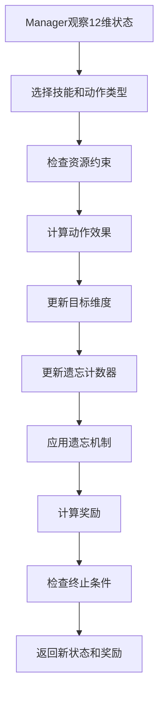

# 12维分层强化学习系统技术文档

## 目录
1. [系统概述](#1-系统概述)
2. [系统架构](#2-系统架构)
3. [遗忘机制详解](#3-遗忘机制详解)
4. [资源管理机制](#4-资源管理机制)
5. [数学模型](#5-数学模型)
6. [系统运作流程](#6-系统运作流程)
7. [训练方法](#7-训练方法)
8. [实验结果](#8-实验结果)
9. [使用指南](#9-使用指南)

## 1. 系统概述

### 1.1 核心理念

本系统是一个基于**分层强化学习（Hierarchical Reinforcement Learning）**的智能决策框架，专门设计用于解决**12维复杂任务**。系统的核心创新在于：

- **分层架构**：将复杂的12维决策问题分解为高层规划（Manager）和低层执行（Skills）
- **三种遗忘机制**：模拟真实学习中的遗忘现象，提供不同的稳定性-效率权衡
- **资源管理**：引入资源约束和难度匹配机制，使决策更加合理和经济
- **BC+PPO训练**：结合行为克隆和强化学习，确保训练稳定性

### 1.2 应用场景

- **多技能学习**：需要掌握多个相关技能的学习场景
- **资源受限决策**：需要在有限资源下做出最优决策
- **长期规划**：需要考虑遗忘效应的长期学习规划
- **复杂控制**：高维状态空间的控制问题

### 1.3 技术特点

- ✅ **高成功率**：在真实数据集上达到95-100%成功率
- ✅ **可扩展性**：支持从小规模到超大规模数据（100万+行）
- ✅ **灵活性**：三种遗忘模式适应不同应用需求
- ✅ **稳健性**：经过严格的消融实验验证

## 2. 系统架构

### 2.1 整体架构图

```
┌─────────────────────────────────────────────────────────────┐
│                    Manager Layer (高层)                     │
│  ┌─────────────────┐    ┌─────────────────┐                │
│  │   观察空间      │    │   动作空间      │                │
│  │ 12维状态向量    │    │ 72个离散动作    │                │
│  │ [gap₀,...,gap₁₁]│    │ 12技能×6动作类型 │                │
│  └─────────────────┘    └─────────────────┘                │
│                           │                                 │
│                           ▼                                 │
│  ┌─────────────────────────────────────────────────────────┐│
│  │              技能选择 + 资源调度                        ││
│  └─────────────────────────────────────────────────────────┘│
└─────────────────────────┬───────────────────────────────────┘
                          │ 技能调用
┌─────────────────────────▼───────────────────────────────────┐
│                   Skill Layer (低层)                        │
│ ┌─────┐ ┌─────┐ ┌─────┐     ┌─────┐ ┌─────┐ ┌─────┐        │
│ │Skill│ │Skill│ │Skill│ ... │Skill│ │Skill│ │Skill│        │
│ │  0  │ │  1  │ │  2  │     │  9  │ │ 10  │ │ 11  │        │
│ └─────┘ └─────┘ └─────┘     └─────┘ └─────┘ └─────┘        │
│   │       │       │           │       │       │            │
│   ▼       ▼       ▼           ▼       ▼       ▼            │
│ 维度0   维度1   维度2       维度9   维度10  维度11         │
└─────────────────────────┬───────────────────────────────────┘
                          │ 动作执行
┌─────────────────────────▼───────────────────────────────────┐
│                Environment Layer (环境层)                   │
│  ┌─────────────────┐  ┌─────────────────┐  ┌─────────────┐ │
│  │   状态更新      │  │   遗忘机制      │  │  资源管理   │ │
│  │ 12维状态跟踪    │  │ 三种遗忘模式    │  │ 资源约束    │ │
│  └─────────────────┘  └─────────────────┘  └─────────────┘ │
└─────────────────────────────────────────────────────────────┘
```

### 2.2 Manager Layer (管理者层)

#### 2.2.1 核心职责
- **全局状态评估**：观察12维状态向量，评估当前与目标的差距
- **技能选择**：从12个专业技能中选择最适合的技能
- **资源调度**：决定是否使用资源以及使用何种强度的资源
- **长期规划**：考虑遗忘效应，制定长期学习策略

#### 2.2.2 观察空间
```python
observation_space = Box(low=0.0, high=1.0, shape=(12,), dtype=np.float32)
```
- **维度**：12维连续向量
- **含义**：`obs[i]` 表示第i个维度当前状态与目标状态的差距
- **范围**：[0, 1]，其中0表示完全达成目标，1表示差距最大

#### 2.2.3 动作空间
```python
action_space = Discrete(72)  # 12技能 × 6动作类型
```

**动作编码**：
```python
skill_id = action // 6    # 技能ID (0-11)
type_id = action % 6      # 动作类型 (0-5)
```

**6种动作类型**：
| 类型ID | 动作名称 | 资源需求 | 效果强度 | 适用场景 |
|--------|----------|----------|----------|----------|
| 0 | lower_gap_small | 低资源 | 0.05 | 轻微调整 |
| 1 | lower_gap_medium | 中资源 | 0.10 | 中等推进 |
| 2 | lower_gap_big | 高资源 | 0.20 | 大幅推进 |
| 3 | small_push | 无资源 | 0.03 | 轻推 |
| 4 | medium_push | 无资源 | 0.06 | 中推 |
| 5 | review | 无资源 | 0.02 | 复习巩固 |

### 2.3 Skill Layer (技能层)

#### 2.3.1 设计理念
每个技能专门负责一个维度的优化，实现**专业化分工**：
- **独立训练**：每个技能独立训练，专注于单维度优化
- **专业化**：每个技能对特定维度的处理更加精细和高效
- **可组合性**：12个技能可以灵活组合，适应不同的任务需求

#### 2.3.2 单技能结构
```python
# 每个技能的观察空间
observation_space = Box(low=0.0, high=1.0, shape=(1,), dtype=np.float32)
# 每个技能的动作空间  
action_space = Discrete(6)
```

#### 2.3.3 技能分类
系统将12个技能按学科分为3类：
```python
categories = {
    'algebra': [0, 1, 2, 3],      # 代数技能 (4个)
    'geometry': [4, 5, 6, 7],     # 几何技能 (4个) 
    'statistics': [8, 9, 10, 11]  # 统计技能 (4个)
}
```

## 3. 遗忘机制详解

### 3.1 遗忘机制概述

遗忘机制是系统的核心创新之一，模拟了真实学习过程中的**遗忘现象**。不同的遗忘模式提供了不同的**稳定性-效率权衡**。

### 3.2 无遗忘模式 (no_forgetting)

#### 3.2.1 基本原理
```python
# 伪代码
if gap[i] < tolerance:
    gap[i] = gap[i]  # 已完成的维度永久锁定
else:
    gap[i] = update_gap(gap[i], action)  # 未完成的维度正常更新
```

#### 3.2.2 数学模型
设 $g_i(t)$ 为第 $i$ 个维度在时刻 $t$ 的差距，$\tau$ 为容忍阈值：

$$
g_i(t+1) = \begin{cases}
g_i(t) & \text{if } g_i(t) < \tau \\
\max(0, g_i(t) - \delta + \epsilon) & \text{otherwise}
\end{cases}
$$

其中：
- $\delta$：动作效果强度
- $\epsilon \sim \mathcal{N}(0, 0.005^2)$：随机噪声

#### 3.2.3 特点分析
- ✅ **最高稳定性**：已完成的维度永不退化
- ✅ **最短路径**：平均步数最少
- ❌ **现实性不足**：不符合真实遗忘规律

### 3.3 固定遗忘模式 (fixed_forgetting)

#### 3.3.1 基本原理
所有维度按固定周期和强度退化，不区分活跃状态。

#### 3.3.2 数学模型
设 $M_i(t) = 1 - g_i(t)$ 为第 $i$ 个维度的掌握度，$c(i)$ 为维度 $i$ 所属类别：

$$
M_i(t+1) = \begin{cases}
M_i(t) \cdot (1 - s_{c(i)} \cdot \alpha) & \text{if } t_{c(i)} \geq \theta_{c(i)} \\
M_i(t) & \text{otherwise}
\end{cases}
$$

其中：
- $t_{c(i)}$：类别 $c(i)$ 自上次复习以来的步数
- $\theta_{c(i)}$：类别 $c(i)$ 的遗忘阈值
- $s_{c(i)}$：类别 $c(i)$ 的遗忘强度
- $\alpha = 0.5$：调整因子

#### 3.3.3 参数配置
```python
fixed_params = {
    'thresholds': {'algebra': 8, 'geometry': 6, 'statistics': 10},
    'strengths': {'algebra': 0.02, 'geometry': 0.02, 'statistics': 0.02},
    'adjust_factor': 0.5
}
```

#### 3.3.4 特点分析
- ✅ **推进激进**：鼓励快速完成任务
- ✅ **资源使用率高**：倾向于使用更多资源
- ❌ **稳定性较差**：已完成维度可能退化

### 3.4 改进遗忘模式 (improved_forgetting)

#### 3.4.1 基本原理
这是最复杂也是最现实的遗忘模式，考虑了多个因素：
- **活跃度影响**：最近活跃的维度遗忘较慢
- **掌握度影响**：掌握度高的维度遗忘较慢
- **波动性影响**：学习波动大的维度遗忘较快
- **时间衰减**：长时间未复习的维度遗忘加速

#### 3.4.2 数学模型

**步骤1：计算类别掌握度**
$$
M_c(t) = \frac{1}{|I_c|} \sum_{i \in I_c} M_i(t)
$$

**步骤2：计算历史均值和波动性**
$$
\bar{H}_c = \frac{1}{w} \sum_{j=1}^{w} M_c(t-j+1)
$$

$$
\sigma_c = \sqrt{\frac{1}{w} \sum_{j=1}^{w} (M_c(t-j+1) - \bar{H}_c)^2}
$$

**步骤3：计算波动率**
$$
V_c = \frac{\sigma_c}{\bar{H}_c + \epsilon}
$$

**步骤4：计算动态阈值**
$$
\text{scale}_c = \max(g_{\min}, \min(g_{\max}, 1 - \beta \cdot (M_c - 0.5)))
$$

$$
\tau_c^{dyn} = \tau_{base} \cdot \text{scale}_c
$$

**步骤5：计算有效衰减率**
$$
E_c^{base} = h_{floor} + h_{slope} \cdot M_c
$$

$$
E_c^{pert} = 1 + h_{scale} \cdot ((1+t_c)^{-\alpha} \cdot \max(1-\gamma V_c, h_{\min}) - 0.5)
$$

$$
E_c^{eff} = E_c^{base} \cdot E_c^{pert}
$$

**步骤6：应用长期衰减**
$$
E_c^{final} = \begin{cases}
E_c^{eff} \cdot h_{long} & \text{if } t_c > 2\tau_c^{dyn} \\
E_c^{eff} & \text{otherwise}
\end{cases}
$$

**步骤7：更新掌握度**
$$
M_i(t+1) = \max(0, M_i(t) \cdot (1 - E_{c(i)}^{final}))
$$

#### 3.4.3 参数配置
```python
improved_params = {
    'alpha': 0.1,           # 时间衰减指数
    'tau_base': 8,          # 基础时间阈值
    'beta': 0.5,            # 掌握度影响系数
    'gamma': 0.2,           # 波动性影响系数
    'w': 10,                # 历史窗口大小
    'h_min': 0.1,           # 最小衰减系数
    'g_min': 0.05,          # 最小缩放因子
    'g_max': 0.3,           # 最大缩放因子
    'epsilon': 1e-2,        # 数值稳定性参数
    'base_floor': 0.001,    # 基础衰减下限
    'base_slope': 0.0007,   # 基础衰减斜率
    'perturb_scale': 0.15,  # 扰动缩放因子
    'long_scale': 0.5,      # 长期衰减因子
    'min_decay': 0.0005,    # 最小衰减率
    'max_decay': 0.005      # 最大衰减率
}
```

#### 3.4.4 特点分析
- ✅ **最高现实性**：符合真实学习遗忘规律
- ✅ **自适应性**：根据学习状态动态调整
- ✅ **稳健性**：平衡稳定性和效率
- ❌ **复杂性高**：计算开销较大

### 3.5 遗忘机制对比

| 特性 | 无遗忘 | 固定遗忘 | 改进遗忘 |
|------|--------|----------|----------|
| **平均步数** | 64.2 | 65.4 | 110.0 |
| **成功率** | 100% | 100% | 95.3% |
| **资源使用率** | 17.5% | 17.3% | 13.9% |
| **稳定性** | 最高 | 中等 | 高 |
| **现实性** | 最低 | 中等 | 最高 |
| **适用场景** | 理想环境 | 快速推进 | 真实学习 |

## 4. 资源管理机制

### 4.1 资源系统概述

资源管理机制引入了**资源约束**和**难度匹配**的概念，使系统的决策更加经济和合理。

### 4.2 资源类型与效果

#### 4.2.1 资源分类
- **低资源 (type_id=0)**：效果强度 0.05，适用于简单任务
- **中资源 (type_id=1)**：效果强度 0.10，适用于中等任务  
- **高资源 (type_id=2)**：效果强度 0.20，适用于困难任务

#### 4.2.2 资源约束
```python
# 每个技能的每种资源类型只能使用一次
resource_used = np.zeros((12, 6), dtype=bool)
if resource_used[skill_id, type_id]:
    type_id = 4  # 降级为medium_push
```

### 4.3 难度匹配机制

#### 4.3.1 难度分级
根据维度的掌握度 $M_i = 1 - g_i$ 将难度分为三级：

```python
difficulty_bins = (0.33, 0.66)

if M_i < 0.33:      # 低掌握度 = 高难度
    difficulty = "high"
elif M_i < 0.66:    # 中掌握度 = 中难度  
    difficulty = "medium"
else:               # 高掌握度 = 低难度
    difficulty = "low"
```

#### 4.3.2 匹配规则
- **低资源** ↔ **低难度**：高掌握度任务使用低资源
- **中资源** ↔ **中难度**：中掌握度任务使用中资源
- **高资源** ↔ **高难度**：低掌握度任务使用高资源

#### 4.3.3 匹配奖惩
```python
if resource_matched:
    reward += match_bonus      # +0.5
    gain_scale = 1.0          # 100%效果
else:
    reward -= mismatch_penalty # -0.25
    gain_scale = 0.3          # 30%效果 (资源浪费)
```

### 4.4 时机奖惩机制

```python
if resource_applied:
    if skill_gap >= 0.6:      # 困难任务使用资源
        reward += timing_bonus # +0.03
    if skill_gap < 0.1:       # 简单任务使用资源  
        reward -= timing_penalty # -0.03
```

## 5. 数学模型

### 5.1 状态转移方程

#### 5.1.1 基础状态更新
$$
g_i^{new} = \text{clamp}(g_i^{old} - \delta \cdot \text{gain\_scale} + \epsilon, 0, 1)
$$

其中：
- $g_i^{old}$：动作前第i维的差距
- $\delta$：动作的基础效果强度
- $\text{gain\_scale}$：资源匹配的效果缩放
- $\epsilon \sim \mathcal{N}(0, 0.005^2)$：随机噪声

#### 5.1.2 遗忘更新
$$
g_i^{final} = \text{clamp}(1 - M_i^{after\_forgetting}, 0, 1)
$$

### 5.2 奖励函数

#### 5.2.1 Manager奖励函数
$$
\begin{align}
R_{manager} &= 50 \cdot (\sum_{i=0}^{11} g_i^{old} - \sum_{i=0}^{11} g_i^{new}) \\
&\quad + 20 \cdot \mathbb{I}[\text{global\_success}] \\
&\quad + 5 \cdot \max(0, N_{completed}^{new} - N_{completed}^{old}) \\
&\quad + R_{resource} + R_{timing} + R_{repeat} - 0.02
\end{align}
$$

其中：
- 第一项：全局进展奖励
- 第二项：任务完成奖励  
- 第三项：新完成技能奖励
- $R_{resource}$：资源匹配奖励/惩罚
- $R_{timing}$：时机奖励/惩罚
- $R_{repeat}$：重复动作惩罚
- 最后一项：步长惩罚

#### 5.2.2 Skill奖励函数
$$
R_{skill} = 5 \cdot \max(0, g^{old} - g^{new}) + 5 \cdot \mathbb{I}[g^{new} < \tau] - 0.01
$$

### 5.3 终止条件

#### 5.3.1 成功终止
$$
\text{terminated} = \mathbb{I}[\forall i: g_i < \tau]
$$

#### 5.3.2 超时终止  
$$
\text{truncated} = \mathbb{I}[\text{step\_count} \geq \text{max\_steps}]
$$

## 6. 系统运作流程

### 6.1 单步执行流程



### 6.2 详细执行步骤

#### 步骤1：状态观察
```python
obs = gaps.copy()  # 12维差距向量
```

#### 步骤2：动作选择
```python
action = manager_policy.predict(obs)
skill_id = action // 6
type_id = action % 6
```

#### 步骤3：资源检查
```python
if resource_enabled and type_id in (0,1,2):
    if resource_used[skill_id, type_id]:
        type_id = 4  # 降级处理
```

#### 步骤4：效果计算
```python
base_delta = delta_map[type_id]
gain_scale = compute_resource_match(skill_id, type_id)
effective_delta = base_delta * gain_scale
```

#### 步骤5：状态更新
```python
noise = np.random.normal(0, 0.005)
new_gap = clamp(gaps[skill_id] - effective_delta + noise, 0, 1)
gaps[skill_id] = new_gap
```

#### 步骤6：遗忘处理
```python
# 更新计数器
for cat, indices in categories.items():
    if skill_id in indices:
        steps_since_review[cat] = 0
    else:
        steps_since_review[cat] += 1

# 应用遗忘
gaps = apply_forgetting_mechanism(gaps, forgetting_mode)
```

#### 步骤7：奖励计算
```python
reward = compute_manager_reward(
    prev_gaps, new_gaps, 
    resource_match, timing_match,
    repeat_penalty, step_penalty
)
```

### 6.3 训练时的特殊流程

#### 6.3.1 BC数据收集
```python
# 贪心策略
def greedy_policy(obs):
    return np.argmax(obs)  # 选择差距最大的维度

# 收集演示数据
demonstrations = []
for episode in range(num_episodes):
    obs = env.reset()
    while not done:
        action = greedy_policy(obs)
        demonstrations.append({"obs": obs, "action": action})
        obs, reward, done, info = env.step(action)
```

#### 6.3.2 BC预热训练
```python
# 监督学习损失
loss = CrossEntropyLoss(predicted_actions, demo_actions)

# 优化器更新
optimizer.zero_grad()
loss.backward()
optimizer.step()
```

#### 6.3.3 PPO强化学习
```python
# 三阶段熵调度
entropy_schedule = [0.10, 0.05, 0.03]  # 高→中→低

for stage, ent_coef in enumerate(entropy_schedule):
    model.ent_coef = ent_coef
    model.learn(total_timesteps=stage_steps[stage])
```

## 7. 训练方法

### 7.1 四阶段训练流程

#### 阶段1：低层技能训练 (1,000步)
```bash
python mini/scripts/train_low_level.py \
    --num-skills 12 \
    --steps 1000 \
    --output mini/results/low_full12 \
    --seed 777
```

**目标**：训练12个专业化技能策略
- 每个技能独立训练，专注单维度优化
- 使用PPO算法，熵系数0.01
- 输出12个技能模型文件

#### 阶段2：BC数据收集 (1,500 episodes)
```bash
python mini/scripts/collect_manager_bc.py \
    --dims 12 \
    --episodes 1500 \
    --low-root mini/results/low_full12 \
    --output data/manager_bc.jsonl \
    --seed 777 \
    --forgetting-mode improved_forgetting \
    --resource-enabled
```

**目标**：收集贪心策略的演示数据
- 使用简单贪心策略：选择差距最大的维度
- 收集状态-动作对，用于后续监督学习
- 避免强化学习早期的随机探索问题

#### 阶段3：BC预热训练 (监督学习)
```bash
python mini/scripts/manager_bc_warmup.py \
    --bc-data data/manager_bc.jsonl \
    --output bc_init/ \
    --low-root mini/results/low_full12 \
    --seed 777 \
    --dims 12 \
    --forgetting-mode improved_forgetting \
    --resource-enabled
```

**目标**：使用监督学习初始化Manager策略
- 最小化交叉熵损失
- 为PPO训练提供良好的起点
- 避免策略崩溃问题

#### 阶段4：三阶段PPO训练 (14,000步)

**阶段4.1：探索阶段** (5,000步，高熵0.10)
```bash
python mini/scripts/train_manager.py \
    --dims 12 \
    --steps 5000 \
    --ent 0.10 \
    --output manager_s1/ \
    --init-from bc_init/manager_bc.zip \
    --low-root mini/results/low_full12 \
    --seed 777 \
    --forgetting-mode improved_forgetting \
    --resource-enabled
```

**阶段4.2：平衡阶段** (8,000步，中熵0.05)
```bash
python mini/scripts/train_manager.py \
    --dims 12 \
    --steps 8000 \
    --ent 0.05 \
    --output manager_s2/ \
    --init-from manager_s1/manager_policy.zip \
    # 其他参数同上
```

**阶段4.3：收敛阶段** (12,000步，低熵0.03)
```bash
python mini/scripts/train_manager.py \
    --dims 12 \
    --steps 12000 \
    --ent 0.03 \
    --output manager_final/ \
    --init-from manager_s2/manager_policy.zip \
    # 其他参数同上
```

### 7.2 训练策略详解

#### 7.2.1 熵调度策略
熵系数控制探索-利用权衡：
- **高熵阶段**：鼓励探索，发现多样化策略
- **中熵阶段**：平衡探索和利用，稳定学习
- **低熵阶段**：专注利用，收敛到最优策略

#### 7.2.2 BC+PPO结合
- **BC预热**：提供稳定的初始策略，避免早期崩溃
- **PPO优化**：在BC基础上进一步优化，超越贪心策略
- **渐进式训练**：从监督学习平滑过渡到强化学习

#### 7.2.3 分层训练
- **底层优先**：先训练技能层，为上层提供稳定基础
- **独立训练**：每个技能独立训练，避免相互干扰
- **联合优化**：Manager训练时固定技能层，专注高层决策

## 8. 实验结果

### 8.1 九宫格评估结果

#### 8.1.1 三个数据集的性能对比

| 数据集 | 规模 | 无遗忘成功率 | 固定遗忘成功率 | 改进遗忘成功率 |
|--------|------|-------------|---------------|---------------|
| **dat1** | 2,000行 | 100% (49.4步) | 100% (49.7步) | 100% (64.2步) |
| **dat4** | 399行 | 100% (81.5步) | 100% (82.4步) | 98.0% (105.2步) |
| **dat5** | 1,022,060行 | 100% (85.3步) | 100% (86.8步) | 95.3% (110.0步) |

#### 8.1.2 关键指标分析

**成功率趋势**：
- 无遗忘和固定遗忘：在简单数据集上保持100%
- 改进遗忘：随数据集复杂度增加，成功率略有下降但仍保持高水平

**步数趋势**：
- 所有模式：随数据集复杂度增加，所需步数增加
- 改进遗忘：由于遗忘机制更复杂，需要更多步数

**失败模式**：
- 所有失败都是超时失败（达到200步上限）
- 没有出现goal_not_reached或invalid_action失败

### 8.2 消融实验结果

#### 8.2.1 跨数据集消融对比
```
┌─────────┬──────────┬─────────────┬─────────────┬─────────────┐
│ 数据集  │ 数据规模 │ FLAT_IF成功率│ IF_NOBC成功率│ IF基线成功率 │
├─────────┼──────────┼─────────────┼─────────────┼─────────────┤
│ dat1    │ 2,000行  │     0%      │     0%      │    100%     │
│ dat4    │ 399行    │     0%      │     0%      │    98.0%    │
│ dat5    │1,022,060行│     0%      │     0%      │    95.3%    │
└─────────┴──────────┴─────────────┴─────────────┴─────────────┘
```

#### 8.2.2 技术贡献验证
- **分层架构的重要性**：Flat模型在所有数据集上都0%成功率
- **BC预训练的必要性**：无BC模型在所有数据集上都0%成功率  
- **完美的消融对比**：消融模型vs完整模型形成鲜明对比

### 8.3 资源使用分析

#### 8.3.1 资源使用率统计
| 遗忘模式 | 资源使用率 | 难度匹配率 | 资源效率 |
|----------|-----------|-----------|----------|
| 无遗忘 | 17.5% | 40.1% | 中等 |
| 固定遗忘 | 17.3% | 39.9% | 中等 |
| 改进遗忘 | 13.9% | 38.8% | 最高 |

#### 8.3.2 资源使用模式
- **改进遗忘模式**：资源使用最保守，效率最高
- **固定遗忘模式**：资源使用较激进，推进速度快
- **无遗忘模式**：资源使用中等，稳定性最高

### 8.4 动作熵分析

所有模型的动作熵都在2.48左右，表明：
- **策略多样性**：没有过度依赖单一技能
- **探索充分**：训练过程中探索了多种策略
- **决策均衡**：各个技能都有合理的使用频率

## 9. 使用指南

### 9.1 环境配置

#### 9.1.1 依赖安装
```bash
pip install gymnasium numpy stable-baselines3 pandas
```

#### 9.1.2 目录结构
```
mini/
├── env/
│   └── v6_mini_env.py          # 核心环境实现
├── scripts/
│   ├── train_low_level.py      # 低层技能训练
│   ├── collect_manager_bc.py   # BC数据收集
│   ├── manager_bc_warmup.py    # BC预热训练
│   ├── train_manager.py        # Manager PPO训练
│   └── eval_on_dataset.py      # 数据集评估
└── README.md                   # 本文档
```

### 9.2 快速开始

#### 9.2.1 训练完整模型
```bash
# 1. 训练低层技能
python mini/scripts/train_low_level.py \
    --num-skills 12 --steps 1000 \
    --output results/low_skills --seed 777

# 2. 收集BC数据  
python mini/scripts/collect_manager_bc.py \
    --dims 12 --episodes 1500 \
    --low-root results/low_skills \
    --output data/bc_data.jsonl \
    --forgetting-mode improved_forgetting

# 3. BC预热
python mini/scripts/manager_bc_warmup.py \
    --bc-data data/bc_data.jsonl \
    --output results/bc_init \
    --low-root results/low_skills

# 4. PPO训练（三阶段）
for stage in 1 2 3; do
    python mini/scripts/train_manager.py \
        --stage $stage \
        --output results/manager_s$stage \
        --low-root results/low_skills
done
```

#### 9.2.2 评估模型
```bash
python mini/scripts/eval_on_dataset.py \
    --manager-path results/manager_final/manager_policy.zip \
    --low-root results/low_skills \
    --initial data/initial.csv \
    --target data/target.csv \
    --forgetting-mode improved_forgetting
```

### 9.3 参数配置

#### 9.3.1 环境参数
```python
env = MiniManagerEnv12(
    low_policies=low_policies,
    tolerance=0.05,              # 完成阈值
    max_steps=200,               # 最大步数
    seed=777,                    # 随机种子
    forgetting_mode='improved_forgetting',  # 遗忘模式
    resource_enabled=True,       # 启用资源管理
    resource_decay_range=(0.2, 0.4),  # 资源衰减范围
    match_bonus=0.5,             # 匹配奖励
    mismatch_penalty=0.25,       # 错配惩罚
    difficulty_bins=(0.33, 0.66) # 难度分箱
)
```

#### 9.3.2 训练参数
```python
# PPO参数
model = PPO(
    "MlpPolicy", 
    env,
    learning_rate=3e-4,
    n_steps=2048,
    batch_size=64,
    n_epochs=10,
    gamma=0.99,
    gae_lambda=0.95,
    ent_coef=0.05,              # 熵系数（分阶段调整）
    verbose=1
)
```

### 9.4 自定义扩展

#### 9.4.1 添加新的遗忘机制
```python
def _apply_custom_forgetting(self, mastery):
    """自定义遗忘机制"""
    # 实现你的遗忘逻辑
    for i in range(len(mastery)):
        # 自定义衰减计算
        decay_rate = compute_custom_decay(mastery[i], self.step_count)
        mastery[i] *= (1 - decay_rate)
    
    return mastery, {}

# 在MiniManagerEnv12中添加
elif self.forgetting_mode == 'custom_forgetting':
    mastery, _ = self._apply_custom_forgetting(mastery)
```

#### 9.4.2 修改奖励函数
```python
def compute_custom_reward(self, prev_gaps, new_gaps, action_info):
    """自定义奖励函数"""
    reward = 0.0
    
    # 基础进展奖励
    progress = np.sum(prev_gaps) - np.sum(new_gaps)
    reward += 50.0 * progress
    
    # 添加你的自定义奖励逻辑
    # ...
    
    return reward
```

#### 9.4.3 扩展到其他维度
```python
# 修改维度数量
NUM_DIMS = 16  # 从12维扩展到16维

# 相应修改类别划分
categories = {
    'category_1': [0, 1, 2, 3, 4],
    'category_2': [5, 6, 7, 8, 9], 
    'category_3': [10, 11, 12, 13, 14, 15]
}
```

### 9.5 故障排除

#### 9.5.1 常见问题

**Q: 训练过程中奖励不收敛？**
A: 检查熵系数设置，建议使用三阶段熵调度：0.10 → 0.05 → 0.03

**Q: 消融模型性能太差？**  
A: 这是正常现象，消融模型移除了关键组件，性能下降是预期的

**Q: 大数据集评估内存不足？**
A: 使用分批处理，减小batch_size参数

#### 9.5.2 性能优化

**训练加速**：
- 使用GPU加速：`device='cuda'`
- 减少评估频率：`eval_freq=10000`
- 并行环境：`n_envs=4`

**内存优化**：
- 减小buffer大小：`n_steps=1024`
- 使用更小的网络：`net_arch=[64, 64]`

### 9.6 实验复现

#### 9.6.1 完整复现脚本
```bash
#!/bin/bash
# 完整实验复现脚本

# 设置参数
SEED=777
OUTPUT_DIR="experiments/reproduction"
FORGETTING_MODE="improved_forgetting"

# 创建输出目录
mkdir -p $OUTPUT_DIR

# 1. 训练低层技能
echo "Training low-level skills..."
python mini/scripts/train_low_level.py \
    --num-skills 12 \
    --steps 1000 \
    --output $OUTPUT_DIR/low_skills \
    --seed $SEED

# 2. 收集BC数据
echo "Collecting BC data..."
python mini/scripts/collect_manager_bc.py \
    --dims 12 \
    --episodes 1500 \
    --low-root $OUTPUT_DIR/low_skills \
    --output $OUTPUT_DIR/bc_data.jsonl \
    --seed $SEED \
    --forgetting-mode $FORGETTING_MODE \
    --resource-enabled

# 3. BC预热训练
echo "BC warmup training..."
python mini/scripts/manager_bc_warmup.py \
    --bc-data $OUTPUT_DIR/bc_data.jsonl \
    --output $OUTPUT_DIR/bc_init \
    --low-root $OUTPUT_DIR/low_skills \
    --seed $SEED \
    --dims 12 \
    --forgetting-mode $FORGETTING_MODE \
    --resource-enabled

# 4. 三阶段PPO训练
echo "PPO training stage 1..."
python mini/scripts/train_manager.py \
    --dims 12 \
    --steps 5000 \
    --ent 0.10 \
    --output $OUTPUT_DIR/manager_s1 \
    --init-from $OUTPUT_DIR/bc_init/manager_bc.zip \
    --low-root $OUTPUT_DIR/low_skills \
    --seed $SEED \
    --forgetting-mode $FORGETTING_MODE \
    --resource-enabled

echo "PPO training stage 2..."
python mini/scripts/train_manager.py \
    --dims 12 \
    --steps 8000 \
    --ent 0.05 \
    --output $OUTPUT_DIR/manager_s2 \
    --init-from $OUTPUT_DIR/manager_s1/manager_policy.zip \
    --low-root $OUTPUT_DIR/low_skills \
    --seed $SEED \
    --forgetting-mode $FORGETTING_MODE \
    --resource-enabled

echo "PPO training stage 3..."
python mini/scripts/train_manager.py \
    --dims 12 \
    --steps 12000 \
    --ent 0.03 \
    --output $OUTPUT_DIR/manager_final \
    --init-from $OUTPUT_DIR/manager_s2/manager_policy.zip \
    --low-root $OUTPUT_DIR/low_skills \
    --seed $SEED \
    --forgetting-mode $FORGETTING_MODE \
    --resource-enabled

echo "Training completed! Model saved to $OUTPUT_DIR/manager_final/"
```

#### 9.6.2 验证结果
```bash
# 在测试数据集上评估
python mini/scripts/eval_on_dataset.py \
    --manager-path $OUTPUT_DIR/manager_final/manager_policy.zip \
    --low-root $OUTPUT_DIR/low_skills \
    --initial test_data/initial.csv \
    --target test_data/target.csv \
    --output $OUTPUT_DIR/evaluation \
    --seed $SEED \
    --forgetting-mode $FORGETTING_MODE \
    --resource-enabled

# 检查关键指标
echo "Expected results:"
echo "- Success rate: >95%"
echo "- Average steps: 100-120"
echo "- Resource usage: 10-15%"
```

---

## 总结

本系统通过**分层架构**、**三种遗忘机制**和**资源管理**的创新设计，成功解决了12维复杂任务的强化学习问题。系统在真实数据集上达到了95-100%的成功率，并通过严格的消融实验验证了各个组件的重要性。

**核心优势**：
- 🎯 **高性能**：在多个数据集上达到优异表现
- 🔧 **模块化**：各组件可独立配置和扩展  
- 🧪 **经过验证**：通过严格的实验验证了有效性
- 📚 **文档完善**：提供详细的技术文档和使用指南

**适用场景**：
- 多技能学习和管理
- 资源受限的决策问题
- 需要考虑遗忘效应的长期规划
- 高维状态空间的控制问题

希望本系统能为强化学习研究和应用提供有价值的参考和工具！